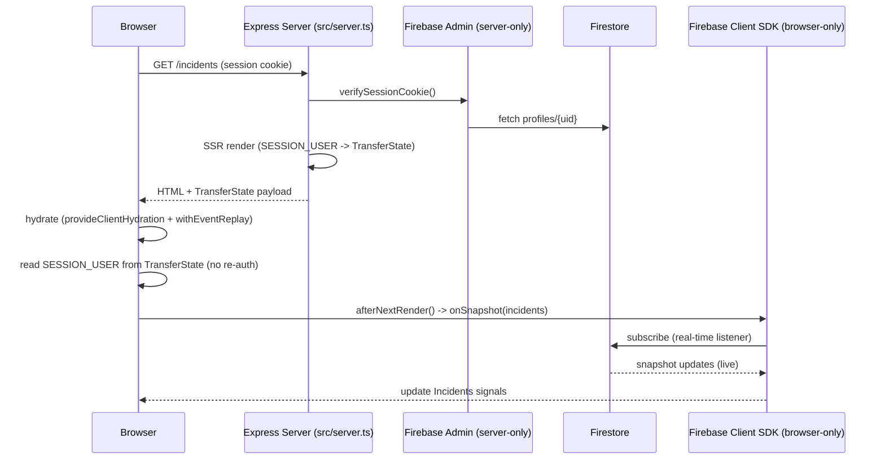

# Real-Time Incidents App (Pulse)

An Angular 22 SSR application for tracking and updating incidents in real time, backed by Firebase (Auth + Firestore).

- **Repository:** https://github.com/asevilla16/RealTimeIncidentsApp

## Submission Requirements

Provide:

- A link to the source-code repository
- A README with setup instructions
- Environment-variable documentation
- Database setup or seed instructions (Migrations or equivalent)
- A brief architecture document (Optional)
- A deployed version (Optional)

The architecture document may be part of the README and should explain:

- The rendering strategy
- Server and client component boundaries
- Streaming implementation
- Real-time data strategy
- Authentication strategy
- Caching and invalidation decisions
- Hydration risks and mitigations
- State-management decisions
- Known limitations
- What you would improve with additional time

Include a diagram if it makes the explanation clearer.

## Setup Instructions

### Prerequisites

- Node.js (Angular 22 toolchain) and npm (`packageManager: npm@11.13.0`)
- A Firebase project with **Authentication** (Email/Password + Google) and **Firestore** enabled
- A Firebase service-account key for that project (Project settings → Service accounts → Generate new private key)

### Install

```bash
npm install
```

### Configure environment variables

Copy `.env.example` to `.env` and fill it in with your Firebase service-account values (see [Environment Variables](#environment-variables) below):

```bash
cp .env.example .env
```

The Firebase **client** config (used in the browser) is not read from `.env` — it lives in `src/environments/environment.ts` / `environment.development.ts` as the `firebaseConfig` object. Replace those values with your own Firebase web app config (Project settings → General → Your apps → SDK setup and configuration).

### Seed the database (optional but recommended)

```bash
npm run seed
```

This creates 4 test users and 8 sample incidents with updates. See [Database Setup / Seed](#database-setup--seed) below.

### Run in development

```bash
npm start
```

Serves the app with `ng serve` (dev server, SSR-equivalent dev rendering) at `http://localhost:4200`.

### Build and run the production SSR server

```bash
npm run build
npm run serve:ssr:real-time-incidents-app
```

This builds the Angular SSR bundle and runs the Express server (`src/server.ts`) from `dist/real-time-incidents-app/server/server.mjs`. It listens on `process.env.PORT` (default `4000`).

### Run tests

```bash
npm test
```

## Environment Variables

All server-side environment variables are read from `process.env` (loaded via `dotenv/config` at the top of `src/server.ts` and `scripts/seed.ts`). They configure the **Firebase Admin SDK**, used only on the server (session verification, seeding) and never bundled into the client.

| Variable | Required | Used in | Purpose |
| --- | --- | --- | --- |
| `FIREBASE_PROJECT_ID` | Yes | `firebase-admin.server.ts` | Firebase project ID for the Admin SDK |
| `FIREBASE_CLIENT_EMAIL` | Yes | `firebase-admin.server.ts` | Service-account client email |
| `FIREBASE_PRIVATE_KEY` | Yes | `firebase-admin.server.ts` | Service-account private key (`\n` sequences are unescaped before use) |
| `FIREBASE_TYPE`, `FIREBASE_PRIVATE_KEY_ID`, `FIREBASE_CLIENT_ID`, `FIREBASE_AUTH_URI`, `FIREBASE_TOKEN_URI`, `FIREBASE_AUTH_PROVIDER_X509_CERT_URL`, `FIREBASE_CLIENT_X509_CERT_URL`, `FIREBASE_UNIVERSE_DOMAIN` | No | — | Not read by app code; present in `.env.example` only because they're part of the downloaded service-account JSON and convenient to paste as-is |
| `NODE_ENV` | No | `session-exchange.server.ts` | When `production`, marks the `session` cookie `secure` |
| `PORT` | No | `src/server.ts` | Port for the Express/SSR server (default `4000`) |

`.env` is git-ignored; `.env.example` documents the expected shape with placeholder values.

The Firebase **client SDK config** (`apiKey`, `authDomain`, `projectId`, `storageBucket`, `messagingSenderId`, `appId`, `measurementId`) is not an environment variable — it's Firebase's public web config, hardcoded in `src/environments/environment.ts` and `environment.development.ts` and swapped per build via Angular's `fileReplacements`. Both files currently point at the same Firebase project (no separate dev/staging project).

## Database Setup / Seed

There are no formal migrations — Firestore is schemaless. Setup consists of:

1. Create a Firestore database in your Firebase project (in Native mode).
2. Configure Firestore **security rules** yourself in the Firebase console — none are checked into this repo (`firestore.rules` / `firestore.indexes.json` do not exist here). Access control today relies on the app's server-verified session cookie plus whatever rules you set; treat this as a setup step you must not skip before going beyond local development.
3. Run the seed script:

   ```bash
   npm run seed
   ```

   `scripts/seed.ts` (via `tsx`):
   - Creates 4 Firebase Auth users — `alex@example.com`, `jordan@example.com`, `sam@example.com`, `priya@example.com`, all with password `password123` (safe to re-run; `auth/email-already-exists` is caught).
   - Writes a matching `profiles/{uid}` Firestore document for each user.
   - Seeds 8 `incidents` documents spanning different severities/statuses, each with 1–3 `updates` subdocuments.
   - Prints `Seed complete. Test login: alex@example.com / password123` when done.

   **Not fully idempotent:** re-running `npm run seed` will duplicate the `incidents`/`updates` documents (only user creation is dedup-safe). Clear the `incidents` collection in the Firebase console before re-seeding if you need a clean slate.

## Architecture

### Rendering strategy

The app uses **Angular SSR (`@angular/ssr`) with per-route server rendering**, served by an Express server (`src/server.ts`, entry configured via `angular.json`'s `outputMode: "server"`). Route rendering modes are declared in `src/app/app.routes.server.ts`:

| Route | Render mode |
| --- | --- |
| `/login` | `RenderMode.Server` |
| `/` (dashboard) | `RenderMode.Server` |
| `/incidents` | `RenderMode.Server` |
| `/incidents/:id` | `RenderMode.Server` |
| `**` (unmatched/404) | `RenderMode.Prerender` |

Every real page is rendered per-request on the server; only the catch-all route is statically prerendered at build time. There is no client-only-rendered route. `provideClientHydration(withEventReplay())` (`src/app/app.config.ts`) then hydrates the server-rendered DOM in the browser and replays any user events (e.g. clicks) that happened before hydration finished.

### Server and client component boundaries

Angular components themselves aren't split into "server" vs "client" component trees (this isn't React Server Components) — instead, **individual pieces of logic within otherwise-universal components/services are gated to run only in the browser**, using the repeated pattern `isPlatformBrowser(platformId)` guard + `afterNextRender()`:

- `Incidents` service (`src/app/core/services/incidents.ts`) — `getIncidentsFromFirebase()` and `getMoreRecentUpdates()` only start inside this guard.
- `Auth` service (`src/app/auth/services/auth.ts`) — `trackClientAuthState()` (Firebase `onAuthStateChanged`) is gated the same way, since Firebase Auth reads IndexedDB.
- `navbar.ts` — the "last synced" timestamp is computed only in the browser, post-hydration.
- `incident-detail.ts` — `watchIncidentUpdates()` is started inside an `effect()` that itself is gated by `isPlatformBrowser` + `afterNextRender`.

The Firebase SDKs are split into two files enforcing this boundary at the module level:

- `src/app/core/firebase/firebase-client.ts` — browser-only Firebase JS SDK (`getClientAuth()`, `getClientDb()`), must never be imported by server-rendered code paths.
- `src/app/core/firebase/firebase-admin.server.ts` — server-only Firebase Admin SDK, reads service-account credentials from `process.env`; excluded from the client bundle (`prebundle.exclude: ["firebase-admin"]` in `angular.json`).

Route-level code splitting (`loadComponent: () => import(...)` in `src/app/app.routes.ts`) is standard Angular Router lazy loading, not a server/client boundary.

### Streaming implementation

**Not implemented.** There are no `@defer` blocks anywhere in the app, and no streaming SSR (out-of-order HTML flush) is used. All page content is rendered in a single server pass. See [Known limitations](#known-limitations).

### Real-time data strategy

Real-time updates are powered entirely by **Firestore's `onSnapshot` listeners** — no polling, no custom WebSocket code. All of it lives in `src/app/core/services/incidents.ts` (`Incidents` service):

- `getIncidentsFromFirebase()` — `onSnapshot` on `incidents` ordered by `updatedAt desc`; drives the dashboard/incidents list.
- `getMoreRecentUpdates()` — `onSnapshot` on a **collection-group** query across every incident's `updates` subcollection. This intentionally has no server-side `orderBy`/`limit` (a composite index isn't provisioned), so sorting and truncation to the 6 most recent happen client-side after each snapshot.
- `watchIncidentUpdates(incidentId, onChange)` — a per-incident `onSnapshot` listener on `incidents/{id}/updates`, started on demand by the incident-detail page and re-subscribed whenever the route `id` changes.

Writes (`createIncident`, `updateIncident`, `addUpdate`) use `addDoc`/`updateDoc` with `serverTimestamp()`; `addUpdate` also bumps the parent incident's `updatedAt` so it resurfaces in the live-sorted list. All listeners are all browser-only (see boundaries above) and unsubscribed via `DestroyRef`/effect cleanup.

### Authentication strategy

Firebase Auth on the client, verified and mediated by a server-owned session cookie — not raw ID tokens — for SSR:

1. **Sign-in** (`Auth.signIn()` / `signInWithGoogle()` in `auth.ts`) uses the Firebase JS SDK against `getClientAuth()`.
2. The client gets an ID token (`getIdToken()`) and `POST`s it to `/api/auth/session`.
3. The server (`session-exchange.server.ts`) verifies the ID token with `adminAuth.verifyIdToken()`, then mints an **httpOnly, `sameSite: 'lax'`, prod-only `secure`** session cookie via `adminAuth.createSessionCookie()` (1-day expiry). It also backfills a `profiles/{uid}` document on first Google sign-in.
4. **Sign-out** calls Firebase `signOut()` then `DELETE /api/auth/session` to clear the cookie.
5. **On every SSR request**, `provideServerSessionUser()` (`session-init.server.ts`) reads the `session` cookie from the incoming `Request`, calls `adminAuth.verifySessionCookie(cookie, /* checkRevoked */ true)`, fetches the user's `profiles/{uid}` doc, and writes the resulting `SessionUser | null` into Angular's `TransferState`.
6. **On the client**, `provideClientSessionUser()` (`session-init.browser.ts`) seeds the same `SESSION_USER` token synchronously from that `TransferState` value — it does not re-derive auth state independently before hydration, which is what keeps SSR output and the client's first render in agreement (see [Hydration](#hydration) below).
7. **After hydration**, `Auth.trackClientAuthState()` subscribes to Firebase's `onAuthStateChanged` (browser-only) to keep the signal live for the rest of the session.
8. **Route protection**: `authGuard` / `guestGuard` (`src/app/core/guards/auth-guard.ts`) applied via `canActivateChild` redirect signed-out users away from the app shell and signed-in users away from `/login`.

### Caching and invalidation

- **`TransferState`** is used for exactly one value — the resolved `SessionUser` — to avoid a server/client auth mismatch on hydration. It is not a general-purpose data cache.
- **No HTTP cache layer**: the app talks to Firestore directly via the client SDK rather than through `HttpClient`, so there's no interceptor/cache-control layer to configure.
- **No explicit Firestore cache configuration**: `getFirestore(app)` is called with default options (no `initializeFirestore`/persistence tuning).
- **No custom invalidation logic**: because all reads are live `onSnapshot` listeners, "invalidation" is implicit — a new snapshot simply overwrites the corresponding signal.
- Static browser assets are served with 1-year `maxAge` cache headers (`src/server.ts`), standard for hashed build output.

### Hydration

This app runs with SSR + `provideClientHydration(withEventReplay())`
(`src/app/app.config.ts`) on every real route (`/`, `/login`, `/incidents`,
`/incidents/:id` — see `src/app/app.routes.server.ts`), so the server-rendered
DOM must match the client's first render exactly, or Angular has to throw away
and rebuild the mismatched nodes instead of hydrating them.

Risks considered, and how the implementation avoids them:

- **Auth state differing between server and client.** `Auth`/`SESSION_USER`
  never re-derives login state on the client by reading a cookie or calling
  Firebase itself before hydration. The server (`session-init.server.ts`)
  verifies the session cookie once via Firebase Admin and writes the result
  into Angular's `TransferState`; the client (`session-init.browser.ts`)
  reads that exact value back out synchronously at bootstrap. Server-rendered
  HTML and the client's first render are therefore always built from the same
  user, by construction — there's no window where the client "flips" to a
  different auth state right after hydration.

- **Browser-only APIs during SSR.** Firestore's `getClientAuth()` /
  `getClientDb()` (`firebase-client.ts`) touch `window`/IndexedDB as a side
  effect, so every call site (`Auth.trackClientAuthState`,
  `Incidents.getIncidentsFromFirebase`, `Incidents.getMoreRecentUpdates`,
  `IncidentDetail`'s update subscription) is gated behind
  `isPlatformBrowser(platformId)` **and** `afterNextRender()`. On the server,
  and during the client's pre-hydration render, these signals sit at their
  initial values (`isLoading`/`isLoadingRecentUpdates` = `true`, empty
  arrays), so SSR output and the client's first paint are identical loading
  skeletons; real Firestore data only arrives after hydration completes, as a
  normal signal update, not a hydration mismatch.

- **Time-dependent values rendered differently on server vs. client.** The
  topbar's "last synced" label (`navbar.ts`) originally called
  `new Date().toLocaleString(...)` in a field initializer, which runs once
  during SSR (server clock/timezone) and again during client construction at
  hydration time (browser clock/timezone) — two different wall-clock moments
  that will typically also disagree by timezone, which is exactly a
  server/client rendering-a-date mismatch. It's fixed the same way as the
  browser-API case above: the signal starts as `''` (identical on server and
  client), and the real timestamp is only computed in the browser inside
  `afterNextRender()`, after hydration has already reconciled the DOM.
  `Incidents.resolvedThisWeek` also uses `Date.now()`, but only over
  `_incidents`, which is populated exclusively inside the same
  `isPlatformBrowser` + `afterNextRender` guard described above — so it's
  always `0` for both the SSR pass and the client's pre-hydration pass, and
  never a live mismatch source.

### State-management decisions

State is managed entirely with **Angular signals** — there is no NgRx and no hand-rolled `BehaviorSubject`-based store:

- `Incidents` service exposes `signal()` state (`_incidents`, `_isLoading`, `_recentUpdateDocs`, `_isLoadingRecentUpdates`) plus derived `computed()`s (`activeIncidents`, `criticalCount`, `investigatingCount`, `resolvedThisWeek`, `severityBreakdown`, `recentUpdates`).
- `Auth` service exposes `isPending`/`error` signals and `user`/`isSignedIn` computed signals derived from the injected `SESSION_USER` token.
- Page components (`dashboard.ts`, `incidents.ts`, `incident-detail.ts`) `inject()` these services and derive further page-local `computed()`s (e.g. client-side filtering/pagination in the incidents list) rather than duplicating state.

`rxjs` is present only as an Angular framework dependency (e.g. Router internals) — it isn't used to build application state. `@angular/fire` is listed in `package.json` but not actually imported anywhere; the app talks to the Firebase SDKs (`firebase`, `firebase-admin`) directly.

### Known limitations

- **No streaming SSR / `@defer`** — every route renders as a single server pass; large pages can't progressively stream in slower sections.
- **Minimal test coverage** — only two boilerplate spec files exist (`app.spec.ts`, `auth-guard.spec.ts`); there are no tests for `Incidents`, `Auth`, or any page component.
- **No server-side pagination** — `Incidents` loads the entire `incidents` collection and the entire `updates` collection-group with no `limit()`; pagination in the incidents list is client-side slicing over already-fully-loaded data. This won't scale as data grows.
- **No Firestore composite index for recent updates** — the collection-group query deliberately skips `orderBy`/`limit` server-side (no infra step provisions the index), trading extra client-side sorting for simpler setup.
- **No retry/backoff or offline support** — `onSnapshot` errors are logged to the console and stop loading; there's no retry, exponential backoff, or offline persistence (`enableIndexedDbPersistence`/`persistentLocalCache` isn't configured).
- **No Firestore security rules or indexes tracked in source** — no `firestore.rules` / `firestore.indexes.json` / `firebase.json` in the repo; access control must be configured manually in the Firebase console, and the client SDK talks to Firestore directly from the browser.
- **Non-configurable session duration** — the session cookie's 1-day expiry is hardcoded in `session-exchange.server.ts`.
- **`console.log`/`console.error` for error handling** instead of user-facing error states or structured logging.
- **Orphaned `orders` page** — `src/app/pages/orders/orders.ts` exists but isn't registered in `app.routes.ts`.
- **Unused `@angular/fire` dependency** left in `package.json`.
- **Hardcoded, shared Firebase project** — `environment.ts` and `environment.development.ts` point at the same Firebase project, so there's no isolated dev/staging environment.

### What we would improve with additional time

- Add streaming SSR (`@defer`) for below-the-fold sections (e.g. incident update history) to improve time-to-first-byte on data-heavy pages.
- Move pagination/filtering to real Firestore queries (`limit`, `startAfter`, `where`) instead of loading full collections client-side.
- Provision and commit `firestore.rules` / `firestore.indexes.json`, including the composite index needed to sort the collection-group "recent updates" query server-side.
- Add retry/backoff and an offline cache (`persistentLocalCache`) for Firestore listeners, plus user-facing error/toast states instead of `console.error`.
- Make session cookie duration configurable via an environment variable.
- Add real unit/integration test coverage for `Incidents`, `Auth`, and the guarded routes.
- Remove the unused `@angular/fire` dependency and the unregistered `orders` page, or finish wiring the latter up.
- Separate Firebase projects per environment (dev/staging/prod) driven by build configuration.

### Diagram


